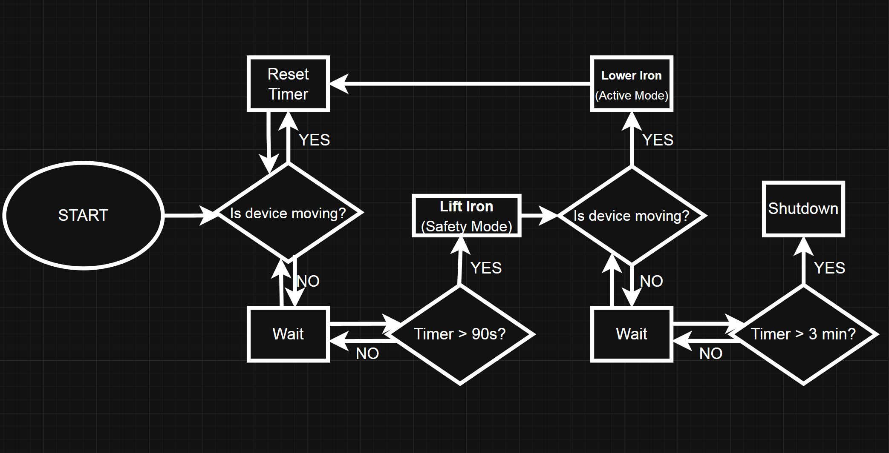

# Automated Iron Safety System (ESP32 Prototype)

An embedded safety solution designed to prevent fire hazards and fabric damage caused by unattended irons. The system utilizes real-time motion detection to identify inactivity and physically lifts the device using a mechanical actuation system.

## 🧠 System Architecture (Finite State Machine)
The core of the project is a state-based control logic that ensures rapid response to user movement while maintaining a high level of safety during idle periods.

## 🚀 Key Features
* **Real-time Motion Detection:** Uses an **ADXL345 accelerometer** to monitor device activity with high precision.
* **Active Safety Mechanism:** Automatically triggers **stepper motors** to lift the iron base if no movement is detected for a set period.
* **Automated Shutdown:** Enters a complete **Shutdown** state after prolonged inactivity (3 minutes) to maximize safety.
* **Instant Reactivation:** Lowers the iron back to the **Active Mode** the moment user motion is detected.

## 🛠️ Technology Stack
* **Microcontroller:** ESP32.
* **Language:** MicroPython.
* **Communication:** I2C Protocol for sensor data acquisition.
* **Hardware components:** ADXL345 Accelerometer and Stepper Motors.

## ⚙️ How It Works (Logic Flow)
1.  **Start:** The system initializes the ESP32 and calibrates the accelerometer.
2.  **Monitoring:** It continuously checks if the device is moving.
3.  **Active Mode:** As long as motion is detected, the iron remains lowered and the timer is reset.
4.  **Safety Mode (Lift):** If the device remains static for **90 seconds**, the motors lift the iron to prevent burning the material.
5.  **Shutdown:** If no movement is detected for a total of **3 minutes**, the system executes a full shutdown for safety.

## 📝 Project Context
This project was developed as a **Team Lead** project at Warsaw University of Technology.
* **Methodology:** Followed a **Low-Fidelity Prototyping** approach to rapidly validate the mechanical and logical integration within a constrained timeframe.
* **Focus:** The emphasis was placed on the software architecture (FSM) and reliable sensor-actuator feedback loops rather than custom hardware casing.